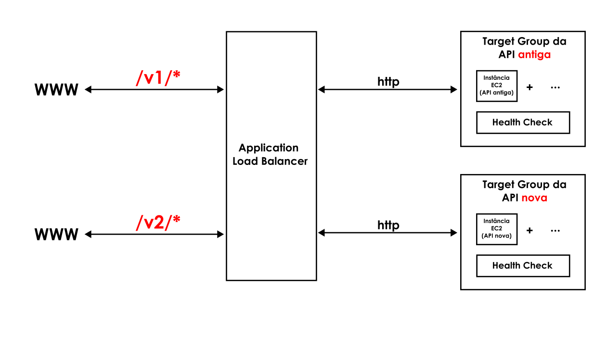

**:warning: Work in Progress!**

<br />

<h1 align='center'>DIETINHA: Back end [versão 2]</h1>

<div align="center">
    <a href="https://github.com/augustolfp/dietinha_frontend"><strong>Repositório do Front end</strong></a>
    <br />
    <a href="https://github.com/augustolfp/Taco-table-simplifier"><strong>Repositório da adaptação da tabela TACO</strong></a>
</div>

<br />

# Descrição

Este projeto é a segunda versão da API desenvolvida para registrar e contabilizar o consumo diário de macronutrientes, que utiliza dados nutricionais da tabela TACO - UNICAMP.

## Principais mudanças em relacão à v1

-   Implementação do _Firebase Auth_ para Autorização e Autenticação;
-   Uso do _Prisma Client_ para a organização das consultas ao Banco de dados;
-   Adesão do padrão _OpenAPI_ para documentação dos _endpoints_;

> A primeira versão dessa API pode ser conferida <a href="https://github.com/augustolfp/calories-tracker-backend">aqui</a>.

<br />

# Como utilizar a API

A documentação dos _Endpoints_ no padrão _OpenAPI_ pode ser conferida no seguinte endereço:

<div align="center"><a href="https://api.dietinha.co/v2/api-docs/">https://api.dietinha.co/v2/api-docs/</a></div>

<br />

# Como configurar um ambiente de desenvolvimento

Esta API pode ser executada em um ambiente de desenvolvimento utilizando o _Docker_:

1. Clone o repositório:

    ```bash
    git clone https://github.com/augustolfp/dietinha_backend.git
    ```

2. Configure as variáveis de ambiente:

    - Configure o **.env** na raiz do projeto, conforme o padrão do **.env.example**;
    - Crie uma instância na plataforma _Firebase Auth_, e configure as credenciais no **privatekey.json**, no caminho _./src/firebase_, conforme o padrão do **privatekey.example.json**;

3. Execute o comando na raiz do projeto para rodar o ambiente de desenvolvimento:

    ```bash
    docker compose -f docker-compose-dev.yml up --build
    ```

4. A API estará disponível:
    - Pode ser acessada em: http://localhost:3001/v2;
    - Um contâiner rodando o _pgAdmin_ será configurado. Para acompanhar o Banco de dados, acesse: http://localhost:5555. Credenciais padrão estão disponíveis no arquivo _Docker-compose-dev_;
    - Existe um _Bind Mount_ configurado no arquivo _Docker_ de desenvolvimento, de modo que alterações no código refletem automaticamente na instância local.

<br />

# Pipeline de Deploy

-   A API está configurada em uma Instância **EC2** da **AWS**, e compartilha um **Application Load Balancer** com sua versão antiga. A estrutura pode ser vista no diagrama a seguir:



-   Um _Github runner_ está configurado para rodar quando há uma alteração na _Branch_ **main**, aplicando as modificações em produção.
    > PS: Para utilizar o runner, é necessário configurá-lo na instância desejada, e adicionar as _Secret Variables_ no Github, conforme a nomeação presente no workflow "deploy.yml".
